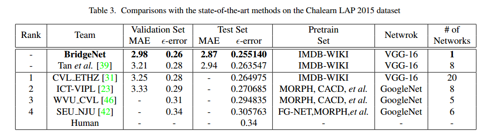

## Multi-loss function for age estimation

#### gitflow

```sh
|--- master
       |----------- label_smoothing
       |----------- regression_loss_combination 
    
# label_smoothing branch
git checkout label_smoothing

# regression_loss_combination branch
git checkout regression_loss_combination

# directory structure
age_estimation_multi_loss repo
├─┬ models
│ ├── Multi_loss_AlexNet_model.py
│ ├── Multi_loss_MobileNet_V1_model.py
│ └── …
└─┬ train_valid
  ├── __init__.py
  ├── train_valid_variant_1_debug_version.py
  ├── age_losses_methods.py
  └── 
```


#### task
- [ ] continue implementing the bar chart drawing function, the reference link is [here](https://pythonspot.com/matplotlib-bar-chart/)
- [ ] implement epilson error function
- [ ] learn LaTex
- [ ] create new branch - regression_loss_combination, to experiments all possible experiments, $15 = 2^{4}-1$
- [ ] reply Yanlin that I am interested in the barcode detection project, the [news here](https://businesstampere.com/scandit-opens-rd-office-in-tampere-to-strengthen-leadership-in-mobile-computer-vision-and-augmented-reality/)
- [ ] **solve the Gaussian loss calculation in the age classification branch. **
- [ ] use the notepad application, which intergates markdown, to do list in one tool. I remember that I have browsed the website.
- [x] experimented the **label smoothing** idea, it improves.
- [x] ~~Gaussian Loss function does not work, no gradient problem~~
- [x] ~~clean the multitask learning source code to multi-loss age estimation task,~~  
- [x] ~~reference ni xingyang's repository.~~


#### table of contents
- [Multi-loss function for age estimation](#multi-loss-function-for-age-estimation)
    - [gitflow](#gitflow)
    - [task](#task)
    - [table of contents](#table-of-contents)
    - [other materials](#other-materials)
    - [experiments](#experiments)
    - [age dataset](#age-dataset)
    - [face detection and alignment](#face-detection-and-alignment)
    - [the state of the art result on age estimation from the BridgeNet paper](#the-state-of-the-art-result-on-age-estimation-from-the-bridgenet-paper)
    - [reference and other materials](#reference-and-other-materials)
  - [test function](#test-function)
****


#### other materials

* [overleaf](https://www.overleaf.com/project/5d2310338e2b2d7e89e37358)
* Google Drive, [Multitask learning](https://drive.google.com/drive/folders/1JSRQxQfCnNyKONFnrRL7D_sDituPLR73?usp=sharing), [Multiloss on age estimation loss](https://drive.google.com/drive/folders/1BNY4DsRx3oGBibo3Xi8oLNVaaYFMRAjl?usp=sharing)

#### experiments
 
```sh
# run experiments for the age estimation
$ python main.py  
```

#### age dataset

1. [cleaned ChaLEARN CVPR 2016](http://chalearnlap.cvc.uab.es/dataset/19/description/) 
2. [IMDB-WIKI](https://data.vision.ee.ethz.ch/cvl/rrothe/imdb-wiki/)
3. [AgeDB](https://ibug.doc.ic.ac.uk/resources/agedb/)


#### face detection and alignment

using Yue's processed images on ChaLearn CVPR 2016 dataset;   
- [ ] elaborate the method of the face detection and face alignment, currently I can not remember.


#### the state of the art result on age estimation from the [BridgeNet](https://arxiv.org/abs/1904.03358) paper




#### reference and other materials

1. the current state of the art approach, [BridgeNet](https://arxiv.org/abs/1904.03358) CVPR 2019
2. the demo paper for writing, [SAF- BAGE](https://arxiv.org/abs/1803.05719), it was accepted by WACV 2019.
3. the similar idea as the head pose estimation, [hopenet](https://arxiv.org/abs/1710.00925), the GitHub repository is [here](https://github.com/natanielruiz/deep-head-pose)

### test function

$l_{n}=-w_{n}\left[t_{n} \cdot \log \sigma\left(x_{n}\right)+\left(1-t_{n}\right) \cdot \log \left(1-\sigma\left(x_{n}\right)\right)\right]$
